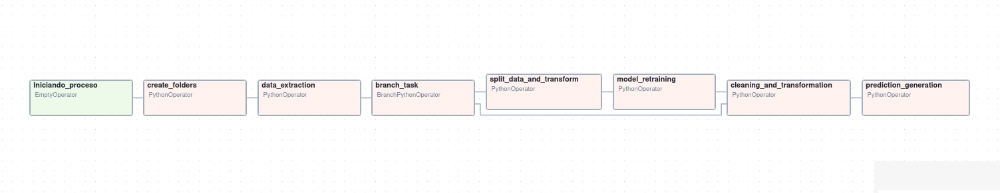

# Documentación Pipeline Airflow

Comando docker para ejecución
```
docker run -p 8080:8080 -v "./resultados:/root/airflow/resultados" entrega2-pipeline
```

## Indicaciones relevantes de la entrega

* Tanto el archivo de transacciones actualizado en cada iteración, como
el modelo actualizado en cada reentrenamiento serán guardado en el directorio
local `repositorio`, pero en producción deberían ser subidos a algún repositorio
o base de datos privada.
Lo mismo con los archivos de clientes y productos.
Los datos nuevos serán importados del directorio local `datos_nuevos`, simulando
una fuente cualquiera de la que debieran ser obtenidos.

* Los datos nuevos son simulados simplemente tomando la última semana del dataset.

* Todos los archivos propios de la ejecución del pipeline serán guardados
en una carpeta con nombre dado por la fecha de ejecución, siguiendo la práctica
usual en el curso.

* Las predicciones serán guardadas en el directorio de trabajo.
Por indicación del docente, en este archivo resultante se filtrará la 
combinación de clientes-productos en el que su modelo prediga que se efectuará una compra (y = 1) 

* Si no existe modelo en el repositorio externo, el pipeline revertirá
a una iteración con reentrenamiento para generarlo.
El trackeo de resultados se almacena en el directorio `train_logs`
que debe ser montado en un volumen de docker.

## Explicación del DAG
El dag se compone de las siguientes tareas:
* dummy_task: Encargada de inicializar el pipeline
* task_create_folders: Encargada de crear los directorios dentro de `dags/` para guardar los datasets parciales de ejecución.
* task_data_extraction: Encargada de la lógica de manejo de los datos de clientes, productos y por sobre todo transacciones. Cruzando la data histórica con la información nueva de transacciones y actualizando la base de datos.
* task_cleaning_and_transformation: Encargada del cruce de los dataset y la creación de variables de resumen del historial de transacciones.
* task_prediction_generation: Encargada de realizar la predicción con la data cruzada y el modelo más actualizado.
* branch_task: Tarea encargada de, una vez extraída la data, decidir si corresponde realizar reentrenamiento, de ser este el caso conecta con la tarea task_split_data_and_transform, 
para realizar el holdout necesario para el entrenamiento.
* task_split_data_and_transform: realiza el holdout del modelo, convirtiendo la última semana recibida en labels y utilizando la data previa para construir las features,
a partir de esta transformación realiza la división en train y test.
* task_model_retraining: Función encargada de reentrenar el modelo, con optimización de hiperparámentros utilizando optuna, así como también de guardar los resultados de la optimización,
para seguimiento del modelo.


